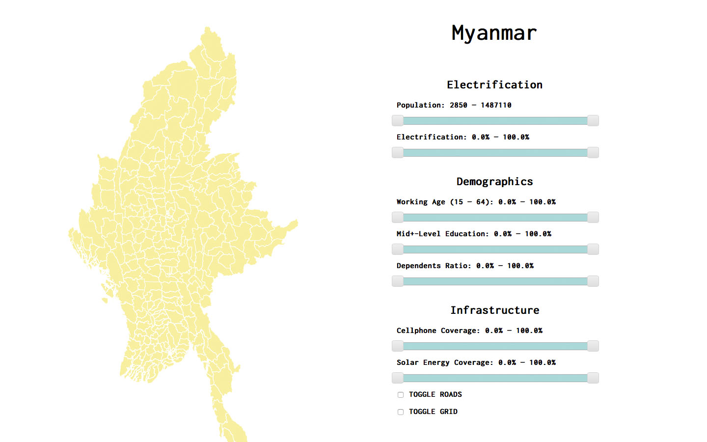
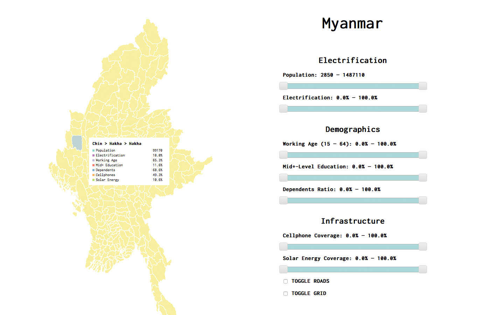
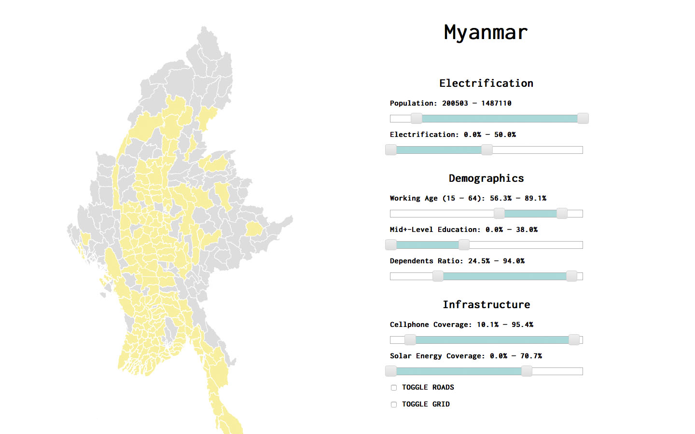
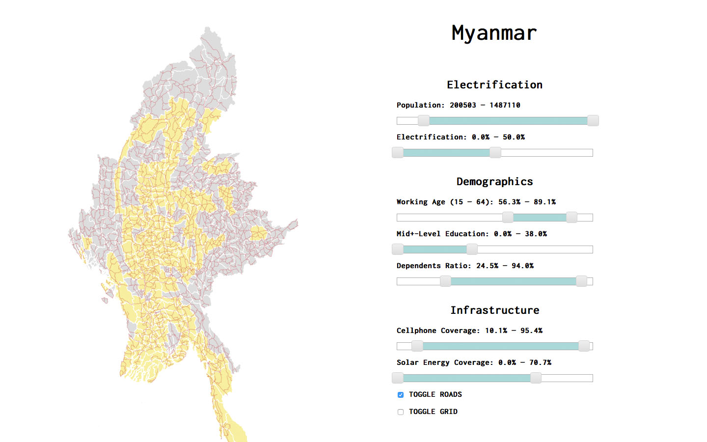
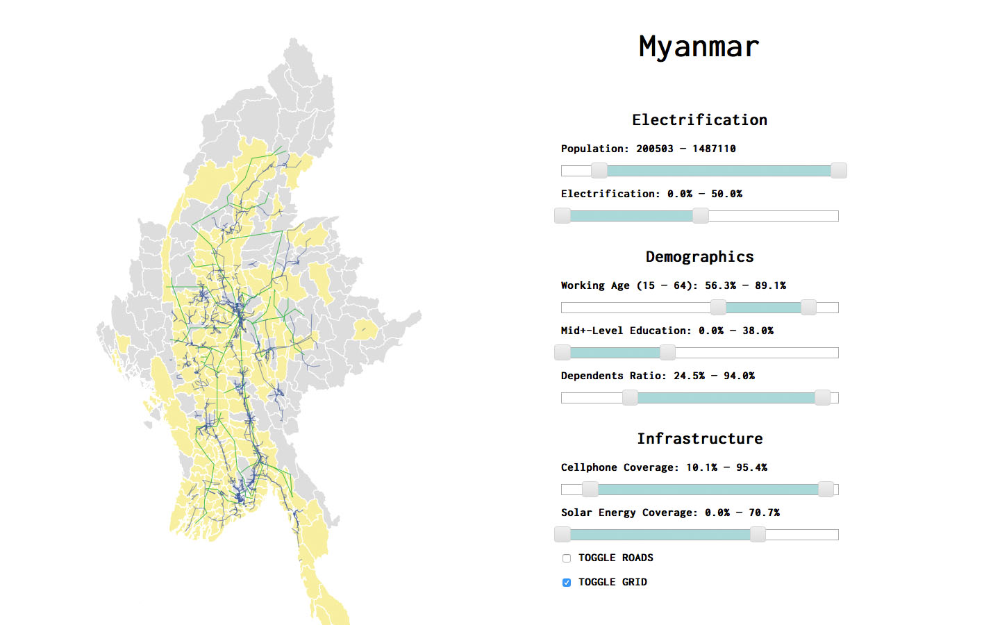
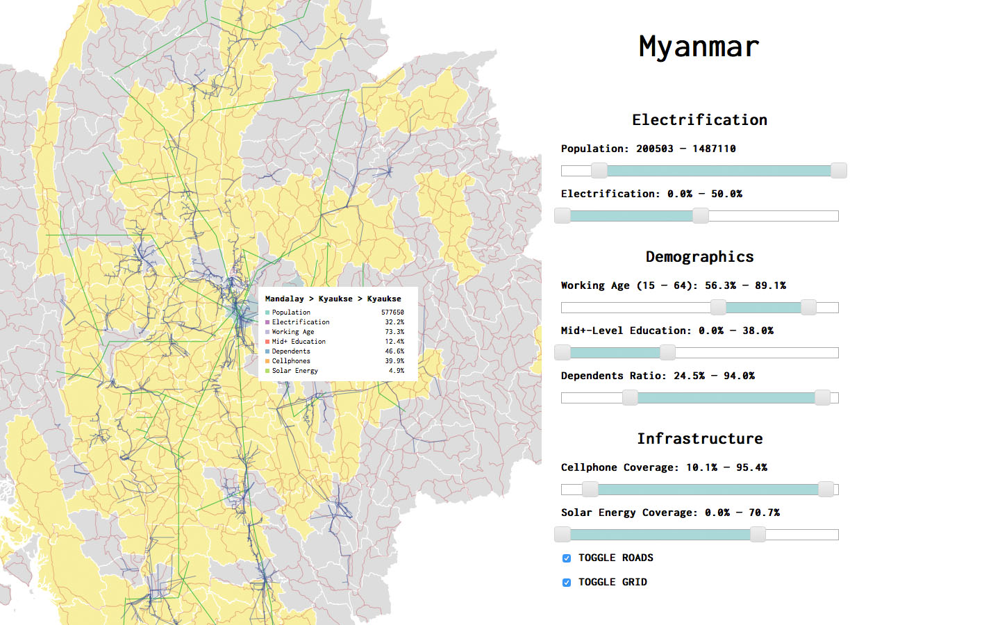

# Booz Allen Hamilton Data Science Challenge - Myanmar Clean Energy

This visualization was created for the Booz Allen Hamilton & U.S. State Department Data Science Challenge. The topic was clean energy in Myanmar.

The purpose of this D3 visualization is to enable interested parties to identify regions of Myanmar that might benefit from solar micro-grids.

- __Screenshot 1__: The right-hand side contains factors identified as strongly affecting economic feasibility.
- __Screenshot 2__: Hovering over a township brings up a box containing information specific it.
- __Screenshot 3__: The sliders can be used to narrow criteria and identify townships, highlighted in yellow, meeting them.
- __Screenshot 4__: You can check the box to visualize the existing road infrastructure.
- __Screenshot 5__: ... And/or the existing grid (high- and medium-voltage lines).
- __Screenshot 6__: You can zoom in and out on any area of the map, and of course, combine any of the above functions.

|  |  |
| Screenshot 1 | Screenshot 2 |
|  |  |
| Screenshot 3 | Screenshot 4 |
|  |  |
| Screenshot 5 | Screenshot 6 |
